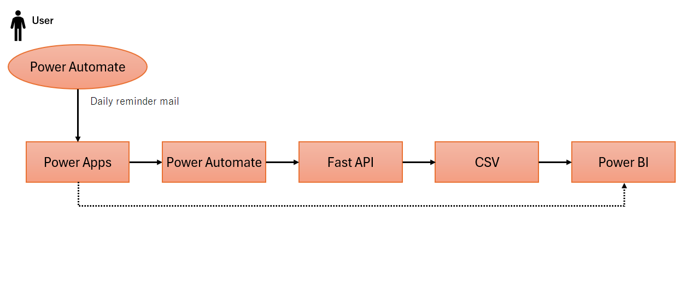

#  Chattomo Mini – Visualizing the Heart × Python AI × Power Platform


---

##  Overview
Chattomo Mini is a **lightweight emotional-support AI assistant** that:
- Receives your daily feelings
- Evaluates emotional mood score
- Detects mental trends
- Visualizes emotions via Power BI

No external AI APIs.  
Everything runs **locally + free** to demonstrate real engineering skills.

---

##  Key Features
-  English & Japanese mood detection
-  Mood score (-3 ~ +3)
-  Emotional tagging (work / sleep / people / love / future …)
-  CSV logging
-  Power BI dashboards
-  Designed for portfolio & interview demonstration

---
##  System Architecture

The Chattomo Mini ecosystem is built using a lightweight but fully functional architecture:




**Flow:**


1. **Power Automate**  
   - Sends daily reminder emails for mood input


2. **Power Apps**  
   - Mood input UI  
   - Displays Chattomo responses  
   - Shows a Power BI dashboard


3. **FastAPI**  
   - Acts as API gateway  
   - Sends user input to the Python emotion engine  
   - Returns mood score + analysis


4. **CSV Storage**  
   - Stores logs  
   - Serves as data source for Power BI


5. **Power BI**  
   - Visualizes moods and emotional trends

---

##  Power BI Dashboards
### 1. Daily Dashboard


**Purpose**：
Provide a clear snapshot of today’s emotional state.

**Highlights**
- Automatically displays today’s entry using DAX logic
- Shows Mood Score, Mood Label, Main Tag, Comment, and 7-day Average
- Dynamic emoji changes based on mood label
- Clean card-based UI designed for readability
- Uses calculated columns (DateOnly, MoodScoreToday, MoodSummary)

### 2. Mood Trend


**Purpose**：
Track mood fluctuations over the recent period.

**Highlights**
- Default view fixed to last 30 days for clarity
- Line chart visualizes day-to-day mood changes
- Supports filtering by Mood Label and custom date range
- Average score card summarizes overall trend
- DateOnly column ensures clean, chronological X-axis

### 3. Mood Trend


**Purpose**：
Track mood fluctuations over the recent period.

**Highlights**
- Horizontal bar chart shows tag frequency
- Heatmap visualizes tag × mood_score relationships
- Dynamic Top 3 Tags extracted with RANKX
- Aggregations and color logic handled in DAX
- Useful for identifying emotional triggers and main focus areas

---

##  Tech Stack
- Python 3.10
- FastAPI
- CSV storage
- Power BI Desktop

---

## 🧪 API Example
```json
POST /analyze
{
  "mood_text": "happy",
  "comment": "Great day today!",
  "user_id": "Anko"
}

{
  "mood_label": "happy",
  "mood_score": 2,
  "tags": ["general"],
  "comment": "Love this mood! ..."
}