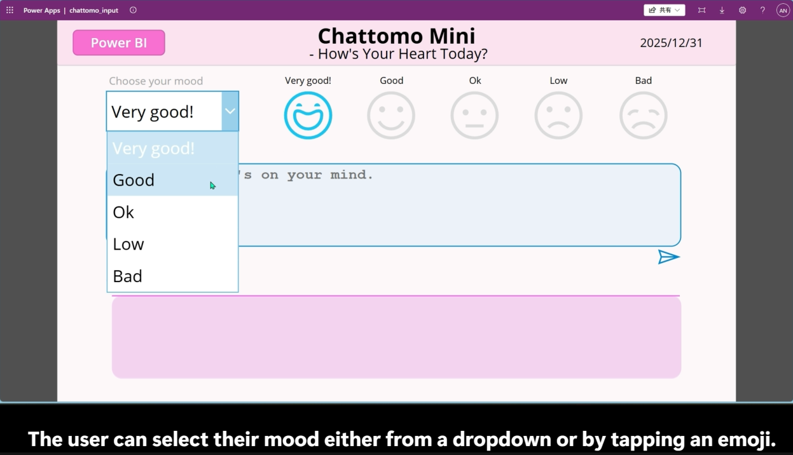
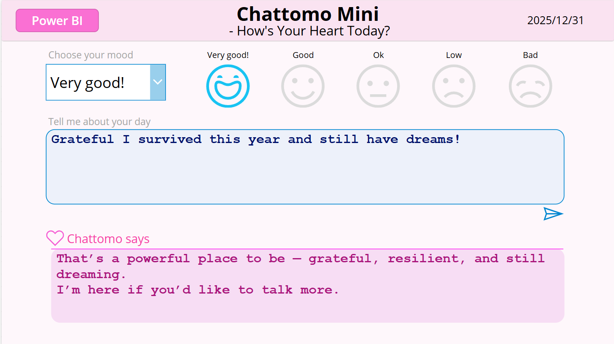
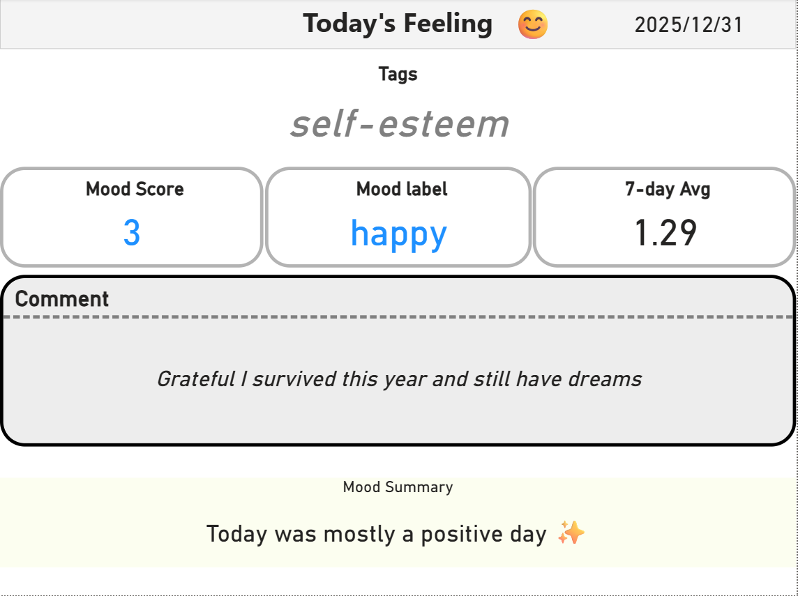

#  Chattomo Mini – Visualizing the Heart × Python AI × Power Platform


---

##  Overview
Chattomo Mini is a **lightweight emotional-support AI assistant** that:
- Receives your daily feelings
- Evaluates emotional mood score
- Detects mental trends
- Visualizes emotions via Power BI

No external AI APIs.  
Everything runs **locally + free** to demonstrate real engineering skills.

---

##  Key Features
-  English & Japanese mood detection
-  Mood score (-3 ~ +3)
-  Emotional tagging (work / sleep / people / love / future …)
-  CSV logging
-  Power BI dashboards
-  Designed for portfolio & interview demonstration

---
##Demo Video
Watch the full demo here:
[]https://youtu.be/woQk0663O2U

---
##  System Architecture

The Chattomo Mini ecosystem is built using a lightweight but fully functional architecture:


**Flow:**

1. **Power Automate (Reminder)**  
   - Sends daily reminder emails to encourage mood input

2. **Power Apps**  
   - Provides the mood input UI  
   - Displays responses returned from Chattomo  
   - Allows users to view Power BI dashboards (optional)

3. **Power Automate (Orchestration)**  
   - Receives input from Power Apps  
   - Sends HTTP requests to the FastAPI backend  
   - Returns analysis results back to Power Apps

4. **FastAPI (Python Backend)**  
   - Acts as the API layer  
   - Processes mood input using Python logic  
   - Returns mood label, mood score, and response text

5. **CSV Storage**  
   - Stores mood logs  
   - Serves as the data source for Power BI

6. **Power BI**  
   - Visualizes moods and emotional trends

---

##  Power Apps (User Interface)


**Purpose**:
Power Apps serves as the primary user interface for Chattomo Mini.
Users select their current mood and optionally describe their day in free text.

The app focuses on a simple, emotionally safe interaction flow,
allowing users to express themselves without pressure or complex input requirements.

The UI itself is intentionally lightweight — its main role is to act as an entry point
to the underlying analysis pipeline and to display Chattomo’s responses in a calm,
non-intrusive way.

> Note:
> In this portfolio prototype, Power BI Desktop is used to demonstrate analytics capabilities.
> In a production environment, the dashboard would be published to Power BI Service
> and embedded directly into the app.

---

##  Python Analysis Logic

Chattomo Mini’s core analysis is implemented in Python and designed
to prioritize emotional safety over aggressive classification.

### Design Principles
- No external AI or LLM APIs
- Rule-based + lightweight NLP
- Emotion-first, not sentiment-score-first
- Responses designed to avoid judgment or pressure

### Mood Scoring
- Mood values are mapped to a simple numeric range (-3 to +3)
- Scores represent **emotional direction**, not mental health diagnosis

### Tag Detection
- Keyword-based topic tagging (work, sleep, people, future, etc.)
- Supports both English and Japanese input
- Tags are used for trend analysis in Power BI, not for response bias

### Response Strategy
- Responses follow a **reflect → validate → invite** pattern
- Inspired by basic counseling and active listening techniques
- Logic is continuously refined based on psychological study
  and feedback from a counseling professional (informal review)

> Note:
> This project does not aim to replace professional mental health support.
> It is designed as a gentle daily reflection tool.

---

##  Power BI Dashboards
### 1. Daily Dashboard



**Purpose**:
Provide a clear snapshot of today’s emotional state.

**Highlights**
- Automatically displays today’s entry using DAX logic
- Shows Mood Score, Mood Label, Main Tag, Comment, and 7-day Average
- Dynamic emoji changes based on mood label
- Clean card-based UI designed for readability
- Uses calculated columns (DateOnly, MoodScoreToday, MoodSummary)

### 2. Mood Trend


**Purpose**:
Track mood fluctuations over the recent period.

**Highlights**
- Default view fixed to last 30 days for clarity
- Line chart visualizes day-to-day mood changes
- Supports filtering by Mood Label and custom date range
- Average score card summarizes overall trend
- DateOnly column ensures clean, chronological X-axis

### 3. Topic Analysis


**Purpose**:
Track mood fluctuations over the recent period.

**Highlights**
- Horizontal bar chart shows tag frequency
- Heatmap visualizes tag × mood_score relationships
- Dynamic Top 3 Tags extracted with RANKX
- Aggregations and color logic handled in DAX
- Useful for identifying emotional triggers and main focus areas

---

##  API Example
Below is a simple request/response example.

```json
POST /analyze
{
  "mood_text": "happy",
  "comment": "Grateful I survived this year and still have dreams!",
  "user_id": "Anko"
}

{
  "mood_label": "happy",
  "mood_score": 3,
  "tags": ["general"],
  "reply_text": "That’s a powerful place・・・"

}
```

---

##  Tech Stack
- Python 3.10
- Power Apps
- Power Automate
- Power BI Desktop
- FastAPI
- CSV storage
